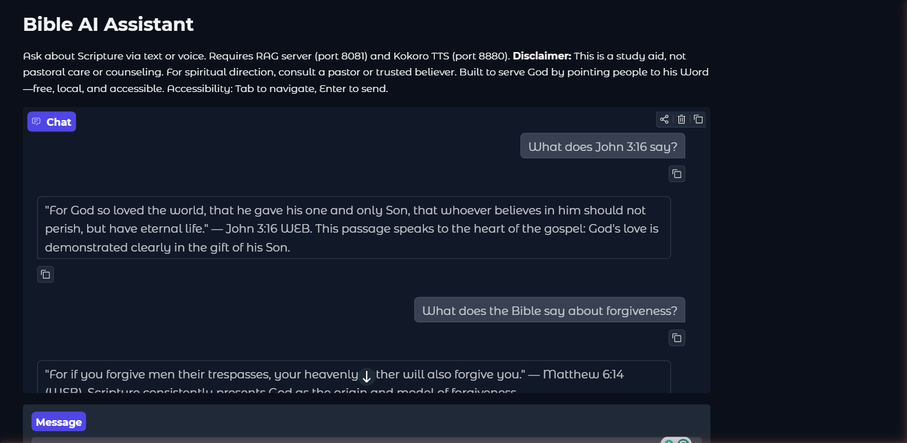
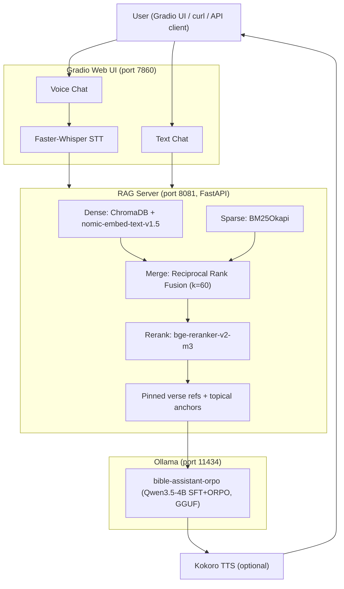

# Bible AI Assistant

[](https://github.com/t-timms/bible-ai-assistant/actions/workflows/ci.yml)
[](https://www.python.org/)
[](https://huggingface.co/Ttimms/bible-ai-qwen3.5-4b-lora)
[](https://wandb.ai/)
[]()
[](https://docs.astral.sh/ruff/)
[](LICENSE)

A locally-hosted Bible Q&A assistant fine-tuned on Qwen3.5-4B with hybrid RAG retrieval, ORPO preference alignment, and optional voice interaction. Built end-to-end: dataset curation, training, evaluation, deployment.



## Why

Most Bible apps offer keyword search. This project builds a real AI that *understands* Scripture — fine-tuned on theology, grounded in retrieved passages, and guardrailed against hallucination. It combines a custom ORPO-trained Qwen3.5-4B model with hybrid RAG (BM25 + dense retrieval + cross-encoder reranking) and constitutional AI safety checks. Voice input and output make it accessible to anyone. Built as a production system, not a demo — 430 tests, 34 W&B training runs, full CI/CD, Docker deployment.

---

## Key Skills Demonstrated

| Area | Details |
|------|---------|
| **LLM Fine-Tuning** | bf16 LoRA (Unsloth/PEFT/TRL) on Qwen3.5-4B; SFT on ~1,800 diverse examples + ORPO alignment on 500 preference pairs |
| **Retrieval-Augmented Generation** | Hybrid retrieval: ChromaDB dense search + BM25 sparse search + Reciprocal Rank Fusion + cross-encoder reranking (bge-reranker-v2-m3) |
| **Evaluation & Benchmarking** | 282-question eval suite across 8 categories (v1 snapshot preserved for reproducibility); keyword-overlap + LLM-as-judge scoring; sha256-pinned versioned benchmark protocol |
| **Model Quantization & Deployment** | GGUF export (F16 + Q4_K_M); local Ollama serving; Jetson Orin Nano deployment guide |
| **MLOps & CI/CD** | GitHub Actions: lint (Ruff), type-check (mypy), unit tests (pytest, 430 tests, 67% coverage / 60% gate) across Python 3.10–3.12, security scan (pip-audit CVE + bandit SAST), Docker build validation; W&B experiment tracking (34 runs) |
| **Production Hardening** | Optional API key auth, per-IP rate limiting (slowapi), `X-Request-ID` request correlation, structured JSON logging, Pydantic-validated settings, 1 MB request body guard |
| **Voice Pipeline** | Faster-Whisper STT (GPU/CPU fallback) + Kokoro TTS; Gradio 6 web UI |
| **Constitutional AI** | Behavioral guardrails grounded in biblical principles; counseling-pattern detection with safety referrals |

## Architecture



## Training Pipeline

### Stage 1: Supervised Fine-Tuning (SFT)

- **Base model:** Qwen/Qwen3.5-4B
- **Method:** bf16 LoRA (r=16, alpha=32, dropout=0.1)
- **Dataset:** ~1,800 examples across 7 categories (verse lookups, RAG-grounded, thematic, general, meta, multi-turn, refusals)
- **Config:** 3 epochs, batch size 2 (gradient accumulation 8), LR 2e-4, cosine schedule, 2048 seq length
- **Result:** Training loss 0.96 → 0.10 over 270 steps (~18 min on RTX 5070 Ti)

### Stage 2: ORPO Preference Alignment

- **Method:** Odds Ratio Preference Optimization (ORPO)
- **Dataset:** 500 preference pairs covering failure modes (hallucinated verses, instruction leaking, repetition, verbosity, off-topic Bible answers)
- **Config:** 1 epoch, 63 steps, LR 5e-6
- **Result:** Loss 1.19 → 0.69; reward accuracy 100% (model correctly distinguishes chosen vs rejected responses)

### Stage 3: GRPO Reasoning Alignment (Planned)

- **Method:** Group Relative Policy Optimization (GRPO) — the technique behind DeepSeek-R1
- **Goal:** Train the model to reason step-by-step before answering, reducing hallucination on complex theological questions
- **Dataset:** Multi-hop Bible reasoning pairs with chain-of-thought rationales
- **Framework:** TRL `GRPOTrainer` + Unsloth backend for VRAM efficiency

### Training Curves

| Metric | SFT Start | SFT End | ORPO Start | ORPO End |
|--------|-----------|---------|------------|----------|
| Training Loss | 0.96 | 0.10 | 1.19 | 0.69 |
| Learning Rate | 9.8e-5 | 2.5e-5 | 2.3e-6 | 4.7e-7 |

See [docs/MODEL_COMPARISON.md](docs/MODEL_COMPARISON.md) for full evaluation results comparing SFT-only vs. SFT+ORPO.

## Evaluation Results

Measured with the **v1** keyword-overlap protocol (`benchmarks/manifest.v1.yaml`, 54 scored questions). These figures predate benchmark protocol v2 (282-question suite with citations verified against the indexed text) and have **not yet been re-run** under it — treat as historical, and see [docs/MODEL_COMPARISON.md](docs/MODEL_COMPARISON.md) for the methodology caveats:

| Model | Size | Verse Accuracy | Citation Rate | Hallucination Rate |
|-------|------|----------------|---------------|--------------------|
| SFT-only (no ORPO) | 8.5 GB | N/A (incoherent) | N/A | N/A |
| SFT+ORPO (Q4_K_M) | 2.5 GB | 5.6% | 74% (40/54) | 20% (11/54) |
| SFT+ORPO (F16) | 8.5 GB | 9.3% | 87% (47/54) | 26% (14/54) |

> **Why ORPO matters:** Without preference alignment, the SFT-only model outputs gibberish. ORPO's 500 targeted preference pairs transform it into a coherent, citation-grounding assistant. The citation rate (74–87%) better reflects retrieval quality than the strict keyword-overlap verse accuracy metric. See [docs/MODEL_COMPARISON.md](docs/MODEL_COMPARISON.md) for full analysis.

## Repository Structure

```
bible-ai-assistant/
├── rag/
│   ├── rag_server.py     # FastAPI app: routes, auth, rate limiting, middleware
│   ├── helpers.py        # Pure string/regex helpers (no I/O — fully unit tested)
│   ├── retrieval.py      # Hybrid retrieval pipeline (dense + BM25 + RRF + rerank)
│   ├── settings.py       # Pydantic-validated config (reads from env / .env)
│   ├── response_cleanup.py
│   └── build_index.py    # ChromaDB index builder
├── training/             # SFT + ORPO training scripts, config.yaml
├── data/                 # Raw Bible JSON + processed training data
├── ui/                   # Gradio 6 web interface (text + voice)
├── voice/                # STT (Faster-Whisper) + TTS (Kokoro)
├── scripts/              # Benchmarking, leaderboard, testing, retrieval metrics, qrels
├── tests/                # 430 pytest tests across 16 modules (67% line coverage, 60% gate)
├── prompts/              # System prompt + 282-question eval suite (8 categories)
├── deployment/           # PC, Jetson, VPS deployment configs + Dockerfiles
├── benchmarks/           # Versioned evaluation protocol (manifest.v1–v3.yaml, sha256-pinned suites)
├── docs/                 # Guides, architecture, training results, model card
├── .github/workflows/    # CI: lint · type-check · security · test · Docker build
├── .pre-commit-config.yaml
├── pyproject.toml        # Project metadata, extras, tool config (ruff, bandit, pytest, coverage)
├── uv.lock               # Pinned dependency lockfile (207 packages)
└── .env.example          # Environment variable reference
```

## Quick Start

Requires: [Docker Desktop](https://www.docker.com/products/docker-desktop/), [Ollama](https://ollama.com), GNU make.

```bash
# 1. Clone the repo
git clone https://github.com/t-timms/bible-ai-assistant.git
cd bible-ai-assistant

# 2. Build the model into Ollama (the GGUF is not on a public registry).
#    Get the adapter from huggingface.co/Ttimms/bible-ai-qwen3.5-4b-lora, then
#    merge + export a GGUF into models/ (see docs/WALKTHROUGH.md steps 8-11):
#    python training/merge_adapters.py && python training/export_gguf.py
python deployment/pc/generate_modelfile.py            # writes deployment/pc/Modelfile
ollama create bible-assistant-orpo -f deployment/pc/Modelfile

# 3. Install the package (all components)
conda activate bible-ai-assistant
pip install -e ".[rag,ui,train,dev]"

# 4. Build the ChromaDB index (one-time setup)
build-index

# 5. Launch
make demo          # auto-starts Ollama, then RAG server + Gradio UI + Kokoro TTS

# 6. Open the UI
# http://localhost:7860
```

> **First voice use:** Faster-Whisper downloads the `large-v3-turbo` STT model (~800 MB) on first use. Expect a delay of ~1 minute before the first voice response.

See `make help` for all available commands.

For the full step-by-step guide (training, merging, deployment): **[docs/WALKTHROUGH.md](docs/WALKTHROUGH.md)**

## Configuration

All runtime settings are read from environment variables (or a `.env` file). Copy `.env.example` to get started.

| Variable | Default | Description |
|----------|---------|-------------|
| `OLLAMA_URL` | `http://localhost:11434` | Ollama inference endpoint |
| `OLLAMA_MODEL` | `bible-assistant` | Model name served by Ollama |
| `RAG_HOST` | `127.0.0.1` | RAG server bind address |
| `RAG_PORT` | `8081` | RAG server port |
| `RAG_TOP_K` | `5` | Retrieved verses per query |
| `HYBRID_CANDIDATES` | `20` | Candidate passages for hybrid retrieval |
| `CONTEXT_MAX_CHARS` | `3500` | Max chars for RAG context block injected into user turns |
| `MAX_QUERY_CHARS` | `2000` | Hard cap on incoming query length |
| `MAX_TOKENS_CEILING` | `4096` | Ceiling applied to client max_tokens before forwarding to Ollama |
| `CHROMA_QUERY_TIMEOUT_SECONDS` | `10.0` | Soft timeout for dense ChromaDB queries |
| `CITATION_VERIFICATION_ENABLED` | `true` | Enable citation verification against indexed text |
| `CITATION_VERIFICATION_MODE` | `log` | `log` (record issues) or `annotate` (append warning markers) |
| `API_KEY` | _(empty)_ | Optional API key — auth disabled when blank |
| `RATE_LIMIT` | `60/minute` | Per-IP rate limit (slowapi format) |
| `LOG_LEVEL` | `INFO` | `DEBUG` / `INFO` / `WARNING` / `ERROR` |
| `LOG_JSON` | `false` | Set `true` for structured JSON logs in production |
| `APP_ENV` | `production` | `development` or `production` |
| `CORS_ORIGINS` | _(empty)_ | Allowed CORS origins (e.g. `["http://localhost:7860"]`) |
| `CHROMA_DB_PATH` | _(empty)_ | Override ChromaDB index location (default: `rag/chroma_db/`) |

## Testing

```bash
# Run all tests (the RAG server deps are needed to import the app under test)
pip install -e ".[rag,dev]"
PYTHONPATH=. pytest tests/

# Run with coverage report
PYTHONPATH=. pytest tests/ --cov=rag --cov=training --cov-report=term-missing
```

The test suite comprises **430 tests** across 16 modules, grouped by area:

| Area | Modules | Focus |
|------|---------|-------|
| RAG helpers & API | `test_rag_helpers`, `test_rag_pure_functions`, `test_rag_api`, `test_retrieval`, `test_prompt_format`, `test_verification` | verse normalization, query classification, thinking-block stripping, URL/metadata guards, SSE processing, FastAPI endpoints (auth, rate limiting, request correlation, model allowlist, counseling guard), BM25 parity, citation verification |
| Training & data | `test_training_utils`, `test_dataset_builder`, `test_dataset_v2`, `test_preference_data` | score extraction/clamping, LoRA key remapping, prompt masking, dataset generation + decontamination, ORPO preference-pair structure and hard negatives |
| Evaluation & benchmarks | `test_evaluate_keyword`, `test_evaluation_questions`, `test_benchmark_manifest`, `test_qrels`, `test_stats` | keyword scoring pipeline, eval-set integrity + train/eval overlap, manifest validation + sha256 pinning, retrieval metrics (recall/MRR/nDCG), Wilson CIs / McNemar / bootstrap |
| Property-based | `test_hypothesis` | Hypothesis invariants on pure helpers — idempotency, type/length bounds |

**Line coverage: 67%** (`pyproject.toml` `fail_under = 60` is the enforced gate). The uncovered portion is the ML training pipeline and ChromaDB retrieval code, which require a GPU and a live database — those are covered by integration tests run separately.

## CI/CD

Every push and pull request runs a staged pipeline (`lint` → `type-check` + `security` → `test` → `docker`):

| Job | What it checks |
|-----|----------------|
| **Lint** | `ruff format --check` + `ruff check` on `training/ rag/ scripts/ ui/ voice/ tests/ deployment/`; `uv lock --check` for lockfile freshness |
| **Type Check** | `mypy --ignore-missing-imports rag/ training/` |
| **Security** | `pip-audit` CVE scan on the active environment (documented `--ignore-vuln` set); `bandit` SAST on `rag/ training/ scripts/ ui/ voice/` |
| **Test** | `pytest tests/` with coverage enforcement (`fail_under = 60` via `pyproject.toml`) on Python 3.10, 3.11, and 3.12 |
| **Docker Build** | Builds `Dockerfile.rag` and `Dockerfile.ui` with Buildx cache — no push, validates the images build cleanly |

## Documentation

| Document | Description |
|----------|-------------|
| [WALKTHROUGH.md](docs/WALKTHROUGH.md) | Step-by-step guide (Steps 1–12) |
| [MODEL_CARD.md](docs/MODEL_CARD.md) | Model card: training, evaluation, limitations, bias |
| [architecture.md](docs/architecture.md) | System design, phase deployment, lessons learned |
| [MODEL_COMPARISON.md](docs/MODEL_COMPARISON.md) | SFT vs. ORPO evaluation and analysis |
| [BENCHMARK_PROTOCOL.md](docs/BENCHMARK_PROTOCOL.md) | Versioned evaluation methodology (protocol v3) |
| [V2_EXECUTION_PLAN.md](docs/V2_EXECUTION_PLAN.md) | Ordered plan for the v2 model rebuild (SFT → ORPO → GRPO) |
| [CONSTITUTION.md](CONSTITUTION.md) | Biblical behavioral guardrails |
| [CONTRIBUTING.md](CONTRIBUTING.md) | Development workflow, branch conventions, PR process |
| [SECURITY.md](SECURITY.md) | Vulnerability reporting and responsible disclosure |
| [CHANGELOG.md](CHANGELOG.md) | Release notes |

## Hardware

| Component | Spec |
|-----------|------|
| GPU | NVIDIA RTX 5070 Ti (16 GB VRAM, Blackwell) |
| RAM | 96 GB DDR5 |
| OS | Windows 11 |
| Training time | ~18 min SFT + ~20 min ORPO |

## Roadmap

| Enhancement | Status |
|---|---|
| **GRPO reasoning alignment** (Stage 3 training) | Planned |
| **GraphRAG** — knowledge-graph retrieval for multi-hop theological questions | Planned |
| **`instructor` structured outputs** — Pydantic-validated LLM responses, replacing raw JSON parsing | Planned |
| **OpenTelemetry traces** — distributed tracing across RAG server and Ollama calls | Planned |
| **Cloud deployment** — Docker + AWS/GCP with CI/CD auto-deploy | Planned |
| **vLLM serving** — swap Ollama for vLLM OpenAI-compatible API for higher throughput | Planned |

---

## Author

**Tremayne Timms** — [GitHub](https://github.com/t-timms)

## License

Code: MIT. Model weights: Qwen license. Scripture text: public domain (WEB, KJV).
